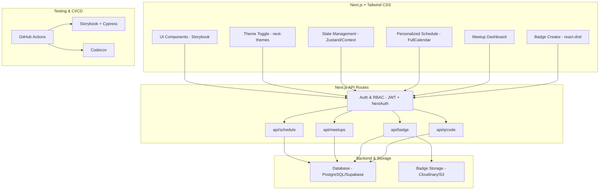

# GSoC 2025: AsyncAPI Conference Website UI Kit Development

## 1. Project Title
**AsyncAPI Conference Website UI Kit Development**

## 2. Overview & Abstract
This project aims to develop a comprehensive and reusable UI Kit to ensure design consistency, modularity, and maintainability for the AsyncAPI Conference website. By migrating the codebase to TypeScript and implementing reusable components with React and Storybook, the project will create a scalable, well-documented, and accessible design system.

The primary goal is to enhance the user experience for conference attendees and streamline the development process for contributors. This initiative matters for open source by providing a robust design system that can be extended across other AsyncAPI projects, fostering brand consistency and improving developer onboarding.

## 3. Features & Objectives
The key deliverables for this project include:
- **Migration to TypeScript:** Refactor the existing codebase to TypeScript for improved maintainability and scalability.
- **Badge Creator:** A drag-and-drop tool for generating customized digital badges for attendees and speakers.
- **Personalized Event Schedule:** An interactive component allowing users to build and manage their own conference schedule.
- **QR Code Check-In System:** A streamlined system for fast event check-in and attendance tracking using unique QR codes.
- **Meetup Hosting and Archive:** Functionality for users to host, join, and browse an archive of community meetups.
- **Analytics and Insights Dashboard:** A dashboard for event organizers to track attendance, engagement, and user feedback.
- **Role-Based Access Control (RBAC):** Secure access control for different user roles (admin, speaker, attendee).

## 4. Tech Stack
- **Frontend:** Next.js, React, TypeScript
- **Styling:** Tailwind CSS
- **UI Development & Documentation:** Storybook
- **State Management:** Zustand / React Context
- **Authentication:** NextAuth.js, JWT
- **Database:** PostgreSQL (via Supabase)
- **Testing:** Jest, React Testing Library, Cypress, Codecov
- **DevOps & CI/CD:** Docker, GitHub Actions

## 5. Installation & Setup
To get the project up and running locally, follow these steps:

1.  **Clone the repository:**
    ```bash
    git clone https://github.com/aksshay88/GSOC-2025.git
    cd GSOC-2025
    ```

2.  **Install dependencies:**
    ```bash
    npm install
    ```

3.  **Set up environment variables:**
    Create a `.env.local` file and add the necessary environment variables (e.g., database connection strings, API keys).
    ```bash
    cp .env.example .env.local
    ```

4.  **Run the development server:**
    ```bash
    npm run dev
    ```

5.  **Open Storybook to view components:**
    ```bash
    npm run storybook
    ```

## 6. Usage Guide
After installation, the application will be running at `http://localhost:3000`. You can explore the different pages and features. The Storybook instance at `http://localhost:6006` provides interactive documentation for all UI components, allowing you to see different states and props.

## 7. Contribution Guidelines
Contributions to this GSoC project are highly welcome!

- **Discussions & Proposals:** For major changes or new features, please open an issue first to discuss what you would like to change.
- **Issues:** Feel free to open issues for bugs, feature requests, or questions.
- **Pull Requests:** All code contributions should be submitted via Pull Requests. Please ensure your PRs are well-documented and include relevant tests.
- **Coding Style:** The project follows standard TypeScript and React conventions, enforced by ESLint and Prettier.

## 8. Timeline & Deliverables

### Community Bonding Period
- Deep dive into the AsyncAPI ecosystem, tooling, and existing website infrastructure.
- Collaborate with mentors to finalize the architectural design and feature scope.
- Set up the development environment (Next.js, Storybook, TypeScript, CI/CD).

### Project Development (Weekly Breakdown)
- **Week 1:** Project Setup & Core Structure
- **Week 2:** Badge Creator MVP
- **Week 3:** Badge Generator Backend
- **Week 4:** Personalized Schedule Builder
- **Week 5-6:** Meetup Dashboard (Frontend & Backend)
- **Week 7:** QR Code Check-in System
- **Week 8:** Analytics Dashboard
- **Week 9:** Polish, Test, & Accessibility Improvements
- **Week 10:** Final Refinements & Handoff

## 9. Architecture
Here is a high-level overview of the proposed system architecture:



## 10. License
This project is licensed under the [Apache 2.0 License](LICENSE).

## 11. Contact & Links
- **GitHub:** [aksshay88](https://github.com/aksshay88)
- **Email:** [aksshaybala8846@gmail.com](mailto:aksshaybala8846@gmail.com)
- **AsyncAPI Slack:** Join the conversation on the official [AsyncAPI Slack](https://www.asyncapi.com/slack-invite).
