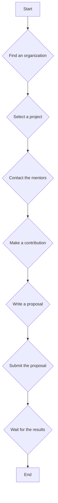
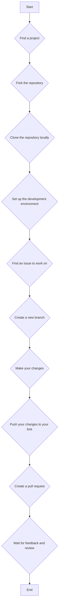

  

# Google Summer of Code (GSOC) Journey

This repository documents my journey through the Google Summer of Code program. It includes my proposals, and in the future, it will also contain my work and contributions to the projects I participate in.

## What is Google Summer of Code?

Google Summer of Code (GSoC) is a global program focused on bringing more student developers into open source software development. Students work with an open source organization on a 10-12 week programming project during their break from school.

You can learn more about the program on the [official GSoC website](https://summerofcode.withgoogle.com/).

## How to Participate in GSoC

Here is a flowchart outlining the steps to participate in GSoC:

## Finding a Project

1.  **GSoC Website:** The official GSoC website lists all the participating organizations.
2.  **Organization's Website:** Once you find an interesting organization, visit their website to learn more about their projects and how to get involved.
3.  **Communication Channels:** Join the organization's communication channels (mailing lists, IRC, Slack, etc.) to interact with the community and mentors.

## How to Start Contributing

Contributing to an open-source project can be daunting at first. Here is a flowchart to guide you:

## My GSoC Proposals

This repository contains my proposals for GSoC.

- **GSoC 2024:** [OpenVINO Proposal](./GSOC-2024/GSOC_openvino-proposal.pdf)
- **GSoC 2025:** [AsyncAPI Proposal](./GSOC-2025/GSOC_Asyncapi-proposal.pdf)
